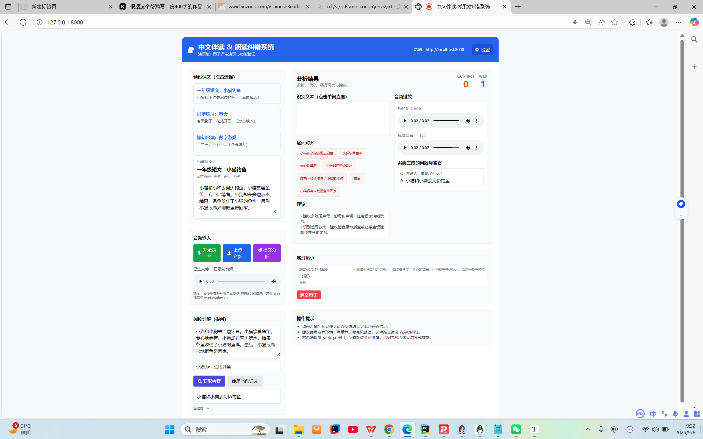
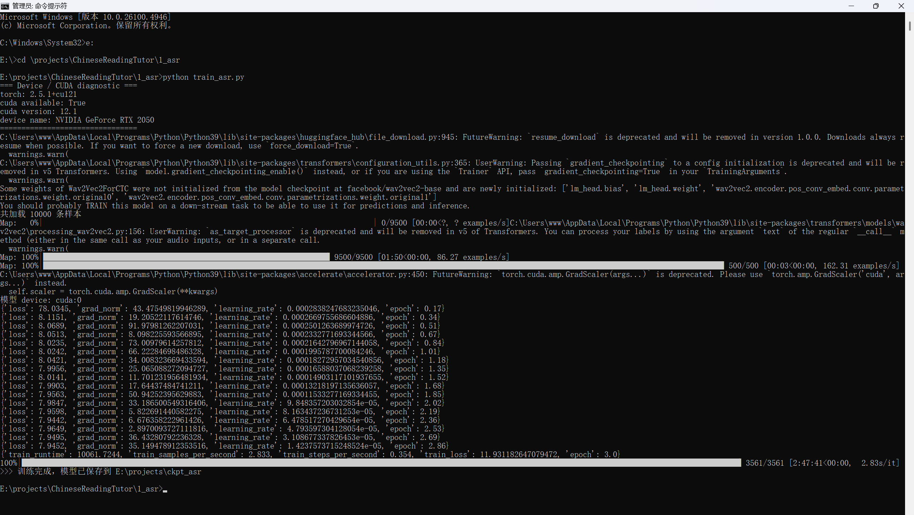
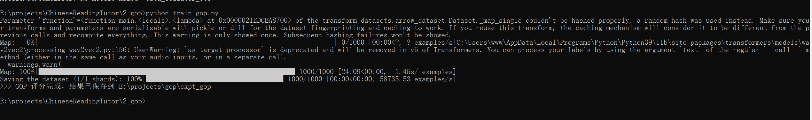
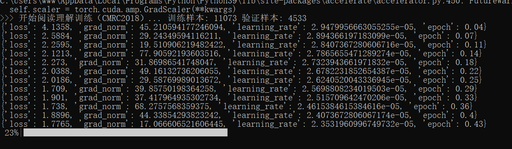
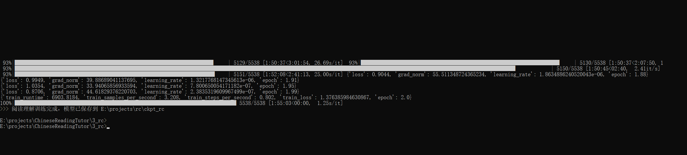
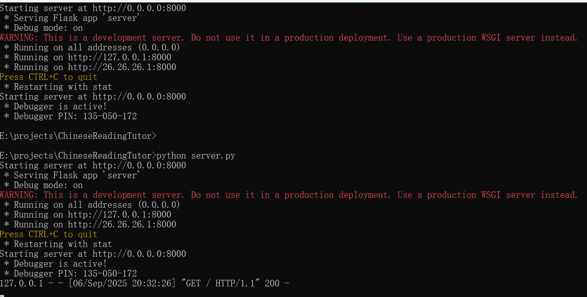
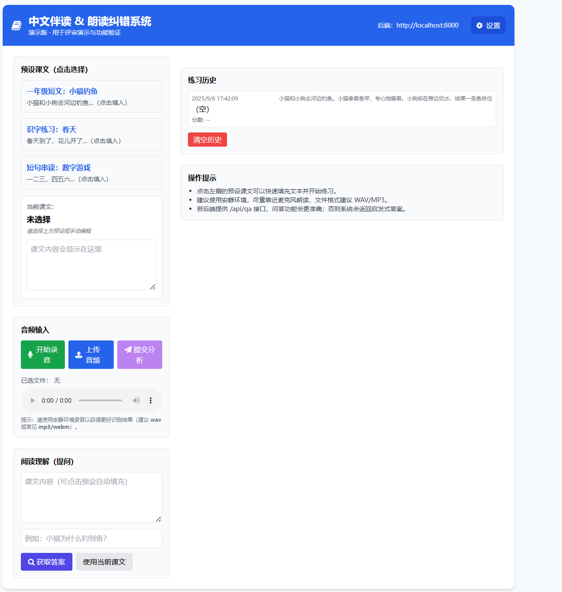

# 语音理解驱动的智能中文伴读与评估系统

<p align="center">
  
</p>


---

## 项目简介

本作品是一个面向**小学语文教育**的智能中文伴读与评估系统，旨在通过语音理解技术为小学生提供一个自动化、可量化的朗读评估与即时反馈工具，解决家庭陪读缺位、教师资源不平衡、缺乏量化评估以及口语发音练习反馈慢等痛点。

系统以"小学生中文陪读"为目标场景，基于本地训练的三套模型（**ASR + GOP + RC**）构建端到端伴读体验。输入学生朗读音频，输出识别文本、发音评分（0–100）、逐词对齐、阅读理解问答与 TTS 标准朗读，**完全支持离线/本地部署**，不依赖大模型服务。

---

## 系统架构

### 总体流程

```
学生朗读 ──▶ ASR 语音识别 ──▶ 识别文本
                │
                ▼
          GOP 发音评分 ──▶ 0–100 分数 + 逐词错误标注
                │
                ▼
          RC 阅读理解 ──▶ 自动提问 + 答案校验
                │
                ▼
          TTS 标准朗读 ──▶ 示范音频
```

### 技术栈

| 层级 | 技术 | 说明 |
|------|------|------|
| 前端 | HTML + Tailwind CSS + Vanilla JS | 轻量零依赖，适合校园内网部署 |
| 后端 | Flask + Python | REST API，统一模型推理 |
| ASR | Wav2Vec2-base + CTC | 端到端语音转文本 |
| GOP | Wav2Vec2ForCTC 声学置信度 | 逐帧最大概率评分 |
| RC | BERT-base-Chinese (CMRC2018) | 抽取式阅读理解 |
| TTS | 第三方引擎 | 标准朗读示范 |
| 训练框架 | PyTorch + HuggingFace Transformers | 模型训练与微调 |

### 目录结构

```
├── 1_asr/                              # ASR 语音识别
│   └── ckpt_asr/                       # Wav2Vec2 微调检查点（训练日志 + config）
│
├── 2_gop/                              # GOP 发音质量评估
│   └── train_gop.py                    # 基于 ASR 模型逐音素打分
│
├── 3_rc/                               # 阅读理解
│   ├── train_rc.py                     # BERT-base-chinese 在 CMRC2018 微调
│   └── eval_rc.py                      # 阅读理解评测脚本（EM、F1）
│
├── result_model/                       # 模型推理封装
│   └── buddy_read.py                   # 统一入口 process_audio()
│
├── server.py                           # Flask 后端 API
├── images/                             # 效果截图与训练结果
└── README.md
```

---

## 核心功能

| 功能 | 描述 |
|------|------|
| **音频输入** | 支持文件上传（wav/mp3/webm）与浏览器录音（MediaRecorder） |
| **ASR 识别** | 将朗读音频转换为汉字文本 |
| **GOP 发音评估** | 输出 0–100 分，逐词/逐音素标注错误（ok/sub/del/ins） |
| **逐词对齐** | 前端高亮展示每个词的识别匹配状态 |
| **RC 问答** | 基于课文自动生成问题并校验学生回答 |
| **TTS 示范朗读** | 提供标准朗读音频供模仿 |
| **历史记录** | 存储练习记录与成绩曲线，支持 CSV 导出 |
| **离线部署** | 数据不出校，无需联网，保护学生隐私 |

---

## 模型详解

### 1. ASR 语音识别

**算法**：Wav2Vec2-base + CTC（Connectionist Temporal Classification）

- 基于 `facebook/wav2vec2-base` 预训练模型微调
- 训练数据：**THCHS-30**（清华大学语音语料库，约 33 小时音频，10,000 句）
- 冻结特征编码器（`freeze_feature_encoder()`），只微调 Transformer 层
- 梯度累积（per_device_batch=1, accumulation_steps=8）解决单卡显存限制
- 评估指标：**WER（词错误率）**

<p align="center">
  
</p>

### 2. GOP 发音质量评估

**算法**：基于 ASR 声学置信度的发音评分

- 利用训练好的 ASR 模型进行前向推理，得到每帧的 softmax 概率
- 对每帧取最大概率类别，再对所有帧求平均，映射到 0–100 分

```python
probs = torch.softmax(logits, dim=-1)
score = probs.max(dim=-1).values.mean().item()
gop_score = min(100, int(score * 100))
```

<p align="center">
  
</p>

### 3. RC 阅读理解

**算法**：BERT-base-chinese + Span Extraction（CMRC2018）

- 基于 `bert-base-chinese` 在 **CMRC2018**（中文阅读理解数据集）上微调
- 使用 sliding window（stride=128）处理长文本，保留 offset mapping 用于答案映射
- 训练目标：start/end logits 的交叉熵损失之和
- 评估指标：**EM（精确匹配）** + **F1 分数**
- 后处理：n-best candidate 选择最高分 span

<p align="center">
  
</p>

<p align="center">
  
</p>

---

## 环境要求

| 依赖 | 版本 |
|------|------|
| Python | 3.8+ |
| PyTorch | 2.x |
| CUDA | 推荐（RTX 2080 训练） |
| Transformers | 4.38.2 |
| Datasets | HF Datasets |
| Flask | 任意最新版 |
| Tailwind CSS | CDN（无本地依赖） |

## 快速开始

### 1. 安装依赖

```bash
pip install torch transformers datasets librosa evaluate flask flask-cors soundfile
```

### 2. 启动后端

```bash
python server.py
```

<p align="center">
  
</p>

### 3. 打开前端

浏览器访问 `http://127.0.0.1:5000`

<p align="center">
  
</p>

### 4. 训练模型（可选）

```bash
# ASR 训练（需 THCHS-30 数据集）
cd 1_asr
python train_asr.py

# GOP 评分
cd ../2_gop
python train_gop.py

# RC 阅读理解训练与评测
cd ../3_rc
python train_rc.py
python eval_rc.py
```

---

## API 接口

| 方法 | 端点 | 说明 |
|------|------|------|
| GET | `/` | 返回前端页面 |
| GET | `/ping` | 健康检查 |
| POST | `/buddy` | 音频 + 参考文本 → 识别/评分/QA 结果 |
| POST | `/api/qa` | 直接问答（passage + question） |

---

## 应用前景

### 课堂教学
教师将课文 PDF 导入，学生用普通耳机麦克风朗读，系统 3 秒内返回"波形-文字-分数"三栏对照，错误音节红色高亮，教师即刻集中讲解共性错点。

### 家庭陪读
家长微信扫码获取离线安装包，居家电脑一键启动。孩子朗读后系统自动生成"今日得分 + 进步曲线 + 错词再练"微报告，家长无需专业背景即可精准督导。

### 区域教研
教育局通过加密 U 盘收集各校脱敏测评数据，利用系统内置的"区域驾驶舱"模块，按年级、乡镇、性别等多维度分析发音薄弱点，为师训与教材修订提供量化依据。

---

## 数据与隐私

- 本项目三大模型**均为本地训练并部署**（非大模型 API）
- 数据集来源：**THCHS-30**（清华大学语音语料库），**CMRC2018**（中文阅读理解数据集）
- 全部数据与模型**可离线运行**，学生声纹数据不出校，符合《个人信息保护法》
- 单台 i5 + 16GB 笔记本可支持 40 点并发

